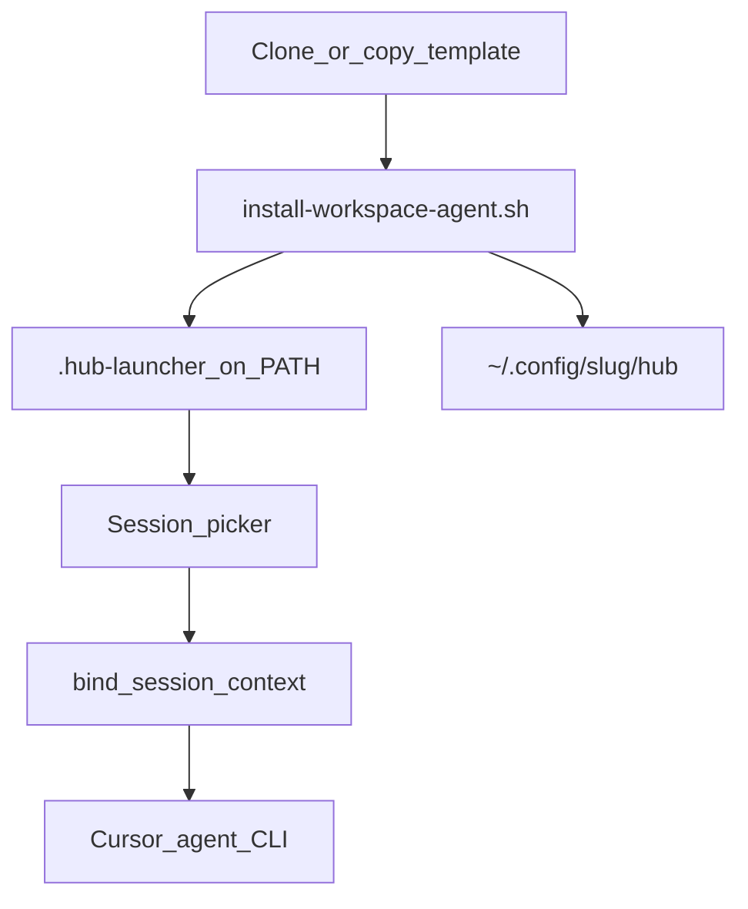

# agentic-multisession-template

Project-agnostic **multi-session Cursor agent hub** template. Each chat and tmux tab binds to a named session; hooks enforce scope and inject context.

Use **GitHub → Use this template** to create your own hub, or clone and copy.

## Prerequisites

- [Cursor](https://cursor.com) IDE
- Cursor **agent CLI** (`agent` on PATH)
- **Python** 3.10+
- **tmux** (terminal workflow)
- **PyYAML**: `pip install -r scripts/requirements.txt`

## Quick start

```bash
# 1. Create your hub from this template (GitHub UI) or:
git clone https://github.com/lgarciaaco/agentic-multisession-template.git my-app
cd my-app

# 2. Install deps + per-project launcher
pip install -r scripts/requirements.txt
./scripts/install-workspace-agent.sh

# 3. Terminal: session picker → agent
cat .hub-launcher          # e.g. my-agent for hub folder my-app
$(cat .hub-launcher)

# 4. Cursor chat
/start-work <task>
```

**Launcher naming:** folder `my-app` → command `my-agent`. Long folder names use the first segment (`agentic-multisession-template` → `agentic-agent`). Override:

```bash
WORKSPACE_AGENT_LAUNCHER=my-agent ./scripts/install-workspace-agent.sh
```

## Architecture



**Resolution order** (chat/tab → session): chat binding → tmux pane option → sibling tab → window name. See [SESSIONS.md](SESSIONS.md).

**Repos:** product code in registered repos (`repos.yaml` → `repos/<name>/` read-only, `sessions/<codename>/worktrees/<name>/` writable). One repo = one registry entry. See [docs/REPOS.md](docs/REPOS.md).

## Layout

```
.cursor/          hooks, rules, skills, commands
repos.yaml.example   registry template → copy to repos.yaml
repos/               reference clones (gitignored)
sessions/            _template + examples; codename dirs local (gitignored)
scripts/             clone-repos, ensure-worktrees, bind, sync, workspace-agent
docs/                REPOS.md
AGENTS.md         agent entry
SESSIONS.md       binding spec
CUSTOMIZE.md      bootstrap checklist (agents)
```

## For agents

| Task | Doc |
|------|-----|
| Bootstrap new hub | [CUSTOMIZE.md](CUSTOMIZE.md) |
| Daily work | [AGENTS.md](AGENTS.md) · [SESSIONS.md](SESSIONS.md) |

## Env (optional)

| Variable | Default |
|----------|---------|
| `WORKSPACE_TMUX_PANE_OPTION` | `workspace-codename` |
| `WORKSPACE_TMUX_WINDOW_PREFIX` | Auto: first slug segment + `-` (e.g. `immo-investor` → `immo-`); set `""` to disable |
| `WORKSPACE_AGENT_BIN` | `agent` |
| `WORKSPACE_AGENT_LAUNCHER` | auto: `<slug-prefix>-agent` |
| `WORKSPACE_HUB_SLUG` | hub folder basename |

## Tests

```bash
python3 scripts/test_session_binding.py
```

## Git

`.hub-launcher` and `.hub-slug` are created by install and gitignored — one launcher per cloned hub.

## Publish as template

Repo maintainers: **Settings → General → Template repository** ✓

## License

MIT — see [LICENSE](LICENSE).
