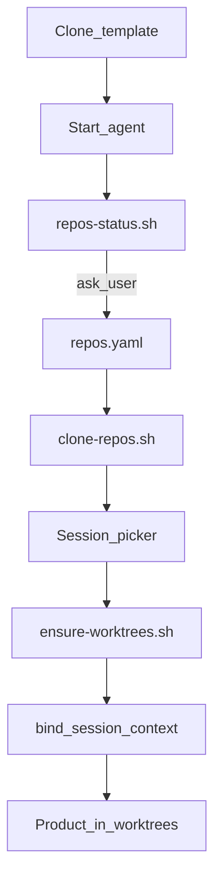

# agentic-multisession-template

Project-agnostic **multi-session Cursor agent hub**. Each chat/tmux tab binds to a codename; hooks enforce scope and inject context.

**Release:** **1.0.0-rc.1** is the **first stable candidate** — a feature-complete hub template (workflow pipeline, self-hosted guards, consolidated docs) ready for real-world use. Feedback on rc.1 tunes the path to **1.0.0**. See [CHANGELOG.md](CHANGELOG.md) and [docs/RC-RELEASE.md](docs/RC-RELEASE.md).

Use **GitHub → Use this template**, or clone this repo as your hub.

## Prerequisites

- [Cursor](https://cursor.com) IDE
- Cursor **agent CLI** (`agent` on PATH)
- **Python** 3.10+
- **tmux** (optional terminal workflow)
- **PyYAML**: `pip install -r scripts/requirements.txt`

## Quick start (agentic-first)

**You:** clone, `cd`, start the agent.

```bash
git clone https://github.com/YOUR_ORG/agentic-multisession-template.git my-hub
cd my-hub
# Cursor: /start-work bootstrap
# or tmux after install: $(cat .hub-launcher)
```

**Agent:** reads [AGENTS.md](AGENTS.md), runs `./scripts/repos-status.sh`, asks which product repos to register (if any), runs setup scripts.

```bash
./scripts/repos-status.sh   # no_repos_yaml → agent asks for alias + git URL + branch
```

Hub-only (no product repos yet) is valid — `repos: {}` until you tell the agent what to add.

**Staying current:** ask the agent *"Is there a new template version?"* then *"Upgrade"* when ready — `./scripts/hub-status.sh` compares your installed `.hub-version` to upstream template releases. Upgrades refresh scripts/hooks/docs without rebuilding sessions or repos. See [CHANGELOG.md](CHANGELOG.md) session notes per release.

Optional manual install before tmux:

```bash
pip install -r scripts/requirements.txt
./scripts/install-workspace-agent.sh
```

## Architecture



**Sessions:** [SESSIONS.md](SESSIONS.md) · **Repos:** [docs/REPOS.md](docs/REPOS.md)

## Layout

```
.hub-version            installed template semver (committed)
.hub-upstream.example   optional upstream URL template
.cursor/              hooks, rules, skills
repos.yaml.example    agent copies → repos.yaml (local)
repos/                reference clones (gitignored)
sessions/             codename dirs (gitignored)
scripts/              repos-status, hub-status, hub-upgrade, clone-repos, ensure-worktrees, bind, …
docs/REPOS.md         registry spec
AGENTS.md             agent entry (read first)
```

## For agents

| Task | Doc |
|------|-----|
| First run / bootstrap | [AGENTS.md](AGENTS.md) · `.cursor/skills/bootstrap-hub` |
| Daily work | `.cursor/skills/session-orchestrator` · [SESSIONS.md](SESSIONS.md) |
| Coding guidelines | `.cursor/rules/agent-guidelines.mdc` · [docs/PROJECT.md](docs/PROJECT.md) (customize from [example](docs/PROJECT.md.example)) |
| Hub upgrade | `.cursor/skills/hub-upgrade` · `./scripts/hub-status.sh` |
| End session | `.cursor/skills/session-end` |

## Env (optional)

| Variable | Default |
|----------|---------|
| `WORKSPACE_TMUX_PANE_OPTION` | `workspace-codename` |
| `WORKSPACE_TMUX_WINDOW_PREFIX` | Auto from hub slug; `""` disables |
| `WORKSPACE_AGENT_BIN` | `agent` |
| `WORKSPACE_AGENT_LAUNCHER` | `<slug-prefix>-agent` |

## Tests

Hub PRs: run the full suite in [CONTRIBUTING.md](CONTRIBUTING.md) (also listed in `.cursor/rules/hub-contributing.mdc`). Quick smoke:

```bash
python3 scripts/test_session_binding.py -v
python3 scripts/test_hub_upgrade.py -v
```

## License

MIT — see [LICENSE](LICENSE).
